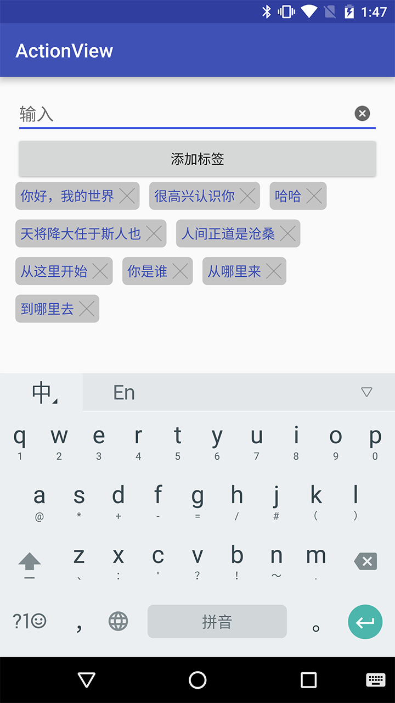

# ActionView
TextView和EditText中的drawable加点击事件
### Example

## Usage
### Gradle
```
compile 'me.codego.view:action-view:0.0.1'
```
### Maven
```
<dependency>
  <groupId>me.codego.view</groupId>
  <artifactId>action-view</artifactId>
  <version>0.0.1</version>
  <type>pom</type>
</dependency>
```
### Layout
```
<me.codego.view.ActionEditText
    android:layout_width="match_parent"
    android:layout_height="wrap_content"
    android:drawableRight="@mipmap/ic_input_delete"
    android:textSize="18sp" />
```

```
<me.codego.view.ActionTextView
    android:layout_width="wrap_content"
    android:layout_height="wrap_content"
    android:layout_margin="5dp"
    android:background="@drawable/bg_tag"
    android:drawableRight="@mipmap/ic_tab_delete"
    android:drawablePadding="5dp"
    android:orientation="vertical"
    android:padding="5dp"
    android:textColor="@color/colorPrimary" />
```
